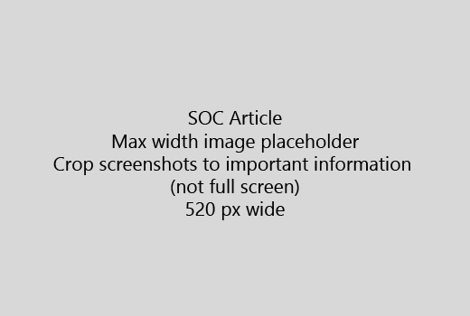

Indítsa el a cikk egy nagyon rövid bevezetés (1 mondat). Tegye az olvasó helyen - Miért vannak azok Itt? Mit kell őket? 
  
1. Get egyenes lépései a feladat gyors listáját.
    
    Ha megmagyarázni a fogalom van szüksége, vagy meg kell előre szükséges lépéseket tenni, hová kell és [hivatkozás](https://support.office.com/article/f37e7984-cf03-4fde-92d3-82970d7e241b.aspx) a koncepció vagy lépéseket a lépcső alatt gyors összefoglaló hozzáadása 
    
2. Folyamatosan eljárások rövid - lehetőleg 5 vagy kevesebb lépéseket, legfeljebb 8.
    
3. **Felhasználói felület stílusának** használata felhasználói felület elemeit, vagy személyek szöveget kell beírni. 
    
4. Igék válassza, jelölje ki, vagy műveletek adja meg, és formázza a menük **menü** \> **parancsot**.
    
5. Tetszés szerint vegye fel a képernyőkép környezet (Ha a felhasználói felület merevlemez található, vagy a feladat elvégzéséhez szükséges).
    
    Maximális szélesség: 520 képpont. Szabványos téma használata, ne jelenjen meg semmilyen személyes adatot, és csak mi jelentősége a megjelenítendő levágása. 
    
    
  
Ha szeretne képernyőkép vagy videó hozzáadása, kétoszlopos rácsvonalak használata és a bal és a videó utasításait vagy képernyőkép - jobb [lépéseket és videó rács példa](https://support.office.com/article/14ce8e82-efa0-47f5-bb84-94f078db3dae.aspx)témakörben talál. 
  
A cél egy cikkben legfeljebb 500 szót.
  
# Például a cikk

[A fénykép módosítása](https://support.office.com/article/555376e0-1fca-49ba-8434-307a0525c767.aspx)
  

