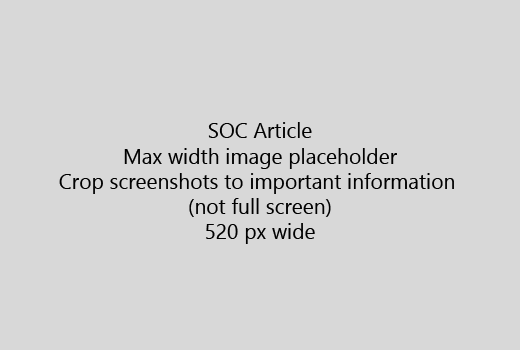

Indítsa el a cikk egy nagyon rövid bevezetés (1 mondat). Tegye az olvasó helyen - Miért vannak azok Itt? Mit kell őket?Start your article with a very short introduction (1 sentence). Put yourself in the reader's place - why are they here? What should they do? 
  
1. Get egyenes lépései a feladat gyors listáját.Get straight to a quick list of steps to accomplish the task.
    
    Ha megmagyarázni a fogalom van szüksége, vagy meg kell előre szükséges lépéseket tenni, hová kell és [hivatkozás](https://support.office.com/article/f37e7984-cf03-4fde-92d3-82970d7e241b.aspx) a koncepció vagy lépéseket a lépcső alatt gyors összefoglaló hozzáadásaIf you need to explain a concept, or they have to do pre-requisite steps, add a quick summary below the step where they need it, and [link](https://support.office.com/article/f37e7984-cf03-4fde-92d3-82970d7e241b.aspx) to the concept or steps. 
    
2. Folyamatosan eljárások rövid - lehetőleg 5 vagy kevesebb lépéseket, legfeljebb 8.Keep procedures short - preferably 5 or fewer steps, no more than 8.
    
3. **Felhasználói felület stílusának** használata felhasználói felület elemeit, vagy személyek szöveget kell beírni.Use **Ui style** for user interface elements or for text people need to enter. 
    
4. Igék válassza, jelölje ki, vagy műveletek adja meg, és formázza a menük **menü** \> **parancsot**.Use the verbs choose, select, or enter as actions, and format menus as **Menu** \> **Command**.
    
5. Tetszés szerint vegye fel a képernyőkép környezet (Ha a felhasználói felület merevlemez található, vagy a feladat elvégzéséhez szükséges).Optionally, add a screenshot for context (if UI is hard to locate, or it's needed to complete the task).
    
    Maximális szélesség: 520 képpont. Szabványos téma használata, ne jelenjen meg semmilyen személyes adatot, és csak mi jelentősége a megjelenítendő levágása.Maximum width: 520 pixels. Use a standard theme, do not show any personal information, and crop to show only what's relevant. 
    
    
  
Ha szeretne képernyőkép vagy videó hozzáadása, kétoszlopos rácsvonalak használata és a bal és a videó utasításait vagy képernyőkép - jobb [lépéseket és videó rács példa](https://support.office.com/article/14ce8e82-efa0-47f5-bb84-94f078db3dae.aspx)témakörben talál.If you want to add a video or screenshot, use a two-column grid and have the steps in the left and the video or screenshot in the right - see [Steps and video grid example](https://support.office.com/article/14ce8e82-efa0-47f5-bb84-94f078db3dae.aspx). 
  
A cél egy cikkben legfeljebb 500 szót.Target no more than 500 words for an article.
  
# Például a cikkExample article

[A fénykép módosításaChange my photo](https://support.office.com/article/555376e0-1fca-49ba-8434-307a0525c767.aspx)
  

