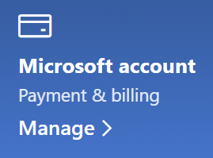

# A Microsoft-fiókkal kapcsolatos információk módosítása

Lépjen ide: [https://account.microsoft.com](https://account.microsoft.com/) és jelentkezzen be, ha szükséges. Ez az irányítópultra irányítja át.  

**Név és személyes adatok szerkesztése**

1. A fiók irányítópultján, a fiók képe és neve mellett kattintson a profil szerkesztése > gombra (további műveletek).
2. A **Profil szerkesztése** lapon használja a rendelkezésre álló hivatkozásokat a profilkép, név, születési dátum, hely, valamint megjelenítési nyelv módosításához. Figyeljen az Xbox- vagy Skype-fiók profiljaira mutató hivatkozásokat, ahol módosíthatja ezeknek a fiókoknak a részleteit.

**E-mail címek és telefonszámok kezelése**

A Microsoft-fiók egy vagy több e-mail-címmel vagy telefonszámmal rendelkezik, amelyek "aliasok" néven vannak feltüntetve. Ezek kezeléséhez:

1. A fiók irányítópultján, a fiók képe és neve mellett kattintson a Profil szerkesztése > három pontra (további **műveletek).**
2. A **Profil szerkesztése** lapon kattintson **A Microsoft-fiókba való bejelentkezési mód kezelése** lehetőségre. 
3. Megjelenik a fiók aliasainak listája, és Ön kezelheti ezt a listát, beleértve az e-mail-címek és telefonszámok hozzáadását és törlését. Itt kiválaszthatja azt is, hogy mely aliasokkal lehet bejelentkezni a fiókba, és hogy mely aliasok tekinthetők "elsődlegesnek", amelyek megjelennek a Windows 10-eszközökön.

**A fizetési módok, valamint a számlázási név és cím kezelése** 

1. A fiók irányítópultján, a fiók képe és neve mellett kattintson a Profil szerkesztése > három pontra (további **műveletek).**
2. A **Fizetés és számlázás** menüben kattintson a **Kezelés** lehetőségre.

    

3. Itt hozzáadhatja, szerkesztheti és eltávolíthatja a fizetési módokat és a hozzájuk kapcsolódó számlázási címeket. 
