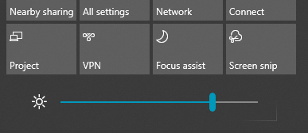

# A képernyő fényerejének módosítása a Windows 10-ben

Ha a Windows 10 újabb, mint az 1903-as verzió, a műveletközpontban található a **Fényerő** csúszka. A műveletközpont megnyitásához  kattintson az Értesítés gombra a tálca jobb szélén, vagy nyomja le a **Windows home + A** billentyűkombinációt.

Ha a Windows 10 egy korábbi verzió, a fényerő csúszkája a Beállítások > **[System > kijelzőben található.](ms-settings:display?activationSource=GetHelp)**

**Megjegyzések:**

- Előfordulhat, hogy a külső monitort is megjelenítő asztali számítógépeken nem jelenik meg a Fényerő módosítása csúszka. A külső monitor fényerejének beállításhoz használja a monitor vezérlőit.
- Ha nincs asztali számítógépe, és a csúszka nem jelenik meg vagy nem működik, próbálja meg frissíteni a képernyőillesztőt. A tálcán lévő keresőmezőbe írja be az  **Eszközkezelő**, majd a találatok listájában válassza az Eszközkezelő lehetőséget. Az **Eszközkezelőben** válassza a **Videokártyák** lehetőséget, majd válassza ki a videokártyát. Tartsa nyomva a videokártya nevét (vagy kattintson rá a jobb gombbal), és kattintson az **Illesztőprogram frissítése parancsra;** majd kövesse az utasításokat.
