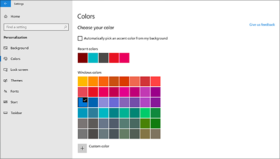
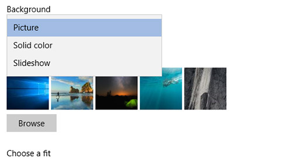

# Az asztal hátterének és színeinek módosítása

A színbeállítást a **Start** Gépház Személyre szabási színek lehetőséget választva, majd válassza ki a saját színét, vagy hagyja, hogy Windows válasszon ki egy kiemelőszínt  >    >    >  a háttérből.

Az asztali háttérképet a **Start** Gépház Személyre szabási háttér menüben módosíthatja, majd válasszon egy képet, egy színt, vagy hozzon létre egy  >    >    >  diavetítést a képekből. 

Több asztali hátteret és színt szeretne? Látogasson [Microsoft Store](https://www.microsoft.com/store/collections/windowsthemes) a webhelyre, és válasszon a több tucat ingyenes téma közül.
