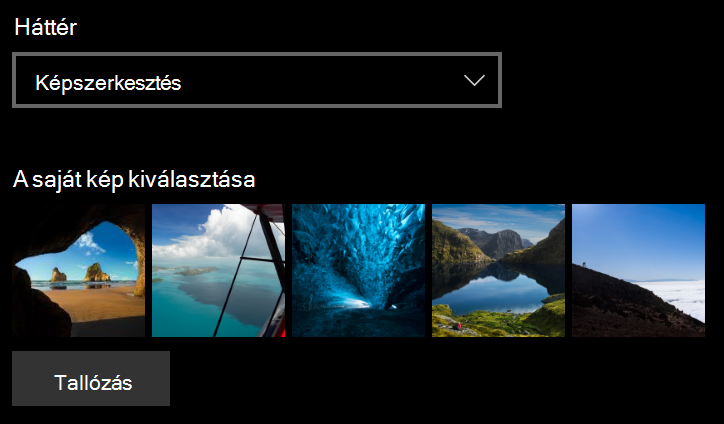
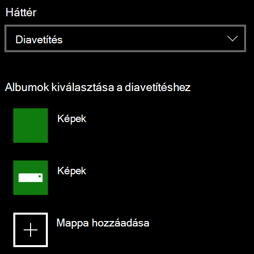

# A zárolási képernyő hátterének módosítása

- Kattintson a **Beállítások**  >  **– Személyre szabás**  >  **zárolási képernyő gombra.** Vagy kattintson vagy koppintson [ide](ms-settings:lockscreen?activationSource=GetHelp).

- Egyéni háttérkép beállításához válassza a  **Kép** lehetőséget a Háttér legördülő listában, és válassza a vagy a Tallózás **a** képhez lehetőséget.

  

- Egyéni képek diavetítésének beállításához válassza  a Diavetítés lehetőséget  a Háttér legördülő listában, és válasszon egy albumot, vagy vegyen fel egy mappát, amely tartalmazza a diavetítéshez a képeket.

  
