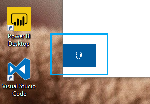

# Kapcsolatfelvétel a fejhallgató gombra kattintvaContact us by clicking the headphone button

Ha fel szeretne venni egy kapcsolatfelvételt a Microsoft ügyfélszolgálatával, kattintson az App bal alsó sarkában a kapcsolatfelvétel e- **mailt** gombra.If you'd like to contact Microsoft Support, please click **Contact us** in the lower left corner of this app. A Beúszás ablakban a termékek és a kibocsátási kategória kiválasztása után a megfelelő támogatási csatornához fog vezetni.Inside the fly-out window, you will be guided to the right support channel after choosing your product and issue category.

Az App többi részén is megtarthatja az interakciót, még akkor is, ha egy kapcsolatfelvételi munkamenetet kezdeményezett.You can keep interacting with the rest of the app even after you have initiated a Contact us session. A kapcsolatfelvételi panel átmenetileg kisméretű lehet, ha az App bármely részén az ikonra kattint.The Contact us panel can be temporarily minimized by clicking anywhere else inside the app. Ha vissza szeretne térni ugyanahhoz a munkamenethez, egyszerűen kattintson ismét a **Kapcsolatfelvétel** gombra.To return to the same session, just click **Contact us** again.
