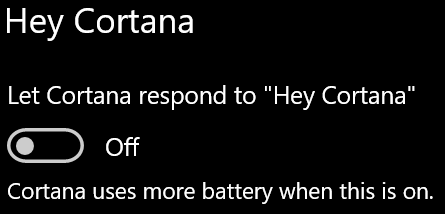

# Cortana nem beszél hozzám, vagy nem hall engem

Ha a "Hey Cortana" funkciót próbálja használni, amely lehetővé teszi, hogy a tálca Cortana gombjának vagy a Cortana panelmikrofon gombjának kiválasztása nélkül beszéljen Cortanával, ellenőrizze, hogy a funkció engedélyezve van-e:

1. Nyissa meg a **Kezdőképernyőt,** majd válassza **[a Beállítások > a Cortana](ms-settings:cortana?activationSource=GetHelp)** lehetőséget.
2. A **Hey Cortana (Cortana)** csoportban kapcsolja be a **Cortana válaszadását a "Hey Cortana" (Hey Cortana) (Be)** **állásra.**

**Az adatvédelmi beállítások megakadályozzák, hogy Cortana meghallja Önt?**

Az adatvédelmi beállítások megakadályozhatják, hogy Cortana reagáljon az Ön hangjára.
- Ellenőrizze, hogy az online beszédfelismerés be van-e kapcsolva:
    - Nyissa meg a **Kezdőképernyőt,** majd kattintson **[a Beállítások > adatvédelem > beszédfelismerés parancsra.](ms-settings:privacy-speech?activationSource=GetHelp)**
    - Az **Online beszédfelismerés**csoportban kapcsolja be a beállítást **Be**beállításra.
- Ellenőrizze, hogy Cortana rendelkezik-e engedéllyel a mikrofon eléréséhez. 
    - Nyissa meg a kezdőképernyőt, majd kattintson **[a Beállítások > adatvédelmi > mikrofon parancsra.](ms-settings:privacy-microphone?activationSource=GetHelp)**
    - A **Válassza ki, hogy mely alkalmazások férhetnek hozzá a mikrofonhoz,** keresse meg **Cortanát** az alkalmazások és szolgáltatások listájában, és győződjön meg arról, **hogy**a kapcsoló be van kapcsolva.

Kérjük, győződjön meg arról is, hogy a hangszórók vagy a mikrofonok működnek, hogy beszélhessenek Cortanával.
