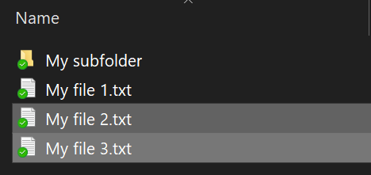
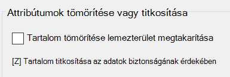

# Fájlok vagy mappa titkosítása a Windows 10 rendszerben

A BitLocker segítségével teljes lemezeket titkosíthat, de csak az egyes fájlok vagy mappák (és tartalmuk) titkosításához:

1. Jelölje ki a **Fájlkezelőben** a titkosítani kívánt fájl(oka)t/mappá(ka)t. Ebben a példában két fájl van kijelölve:

    

2. Kattintson a jobb gombbal a kiválaszott fájl(ok)ra, és válassza a **Tulajdonságok** parancsot.

3. A **Tulajdonságok** ablakban kattintson a **Speciális** lehetőségre.

4. A **Speciális beállítások** ablakban válassza a **Tartalom titkosítása az adatok biztonsága érdekében** jelölőnégyzetet:

    

5. Kattintson az **OK** gombra.
