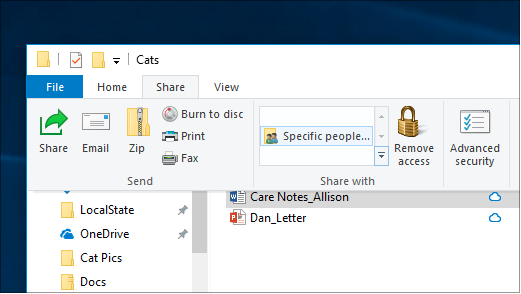
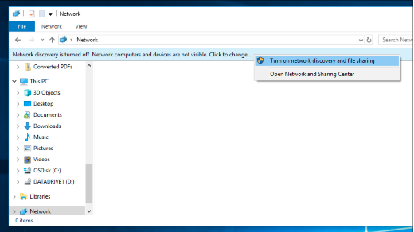

# Fájlmegosztás hálózaton keresztül a Windows 10-ben

**Megjegyzés:** Ha korábban az Otthoni csoportot használta fájlmegosztáshoz, vegye figyelembe, hogy az Otthoni csoport el lett távolítva a Windows 10-ből (1803-as verzió). Mostantól a Windows 10 beépített szolgáltatásaival megoszthatja a nyomtatókat és a fájlokat.

**Fájlok és mappák megosztása hálózaton keresztül**

- A **Fájlkezelőben**jelöljön ki egy fájlt, > kattintson a **Megosztás** > felső részén található **Megosztás** gombra, majd kattintson a **Konkrét személyek elemre.**

    
          
- Ha egyszerre több fájlt jelöl ki, az összeset ugyanúgy megoszthatja. Ez szerkezet részére tartók, túl.

**Fájlokat megosztó eszközök megtekintése a hálózaton**

- A **Fájlkezelőben**nyissa meg a **Hálózat**alkalmazást. Ha a hálózatfelderítés nincs engedélyezve, a következő hibaüzenet jelenik meg: "A hálózatfelderítés ki van kapcsolva..."

- Kattintson a **Hálózatfelderítés kikapcsolt** szalagcímre, majd **a Hálózatfelderítés és fájlmegosztás bekapcsolása**parancsra.

    

[További információ a hálózaton keresztüli fájlmegosztásról](https://support.microsoft.com/help/4092694/windows-10-file-sharing-over-a-network)

[Fájlok megosztása alkalmazások, OneDrive, e-mailek és egyebek használatával](https://support.microsoft.com/help/4027674/windows-10-share-files-in-file-explorer)
