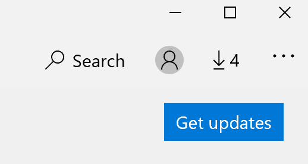

# Az alkalmazások megjelenítési nyelvének kijavíta

Miután a Windows 10-ben módosítja a megjelenítési nyelvet, egyes alkalmazások továbbra is az előző nyelvet használják a megnyitásukkor. Ennek az az oka, hogy az appok új verzióit le kell tölteni az áruházból az ehhez a nyelvhez. A probléma megoldásához megvárhatja az automatikus frissítést, vagy kézzel is telepítheti az appok frissített verzióját.

A frissítés manuális telepítéséhez nyissa meg a **Microsoft Store-t,** és kattintson a **letöltések** és frissítések elemre a jobb felső sarokban. Ezután kattintson a **Frissítések letöltése elemre.** Ha a frissítés befejezése után nem változik meg a nyelv, indítsa újra a számítógépet.

A beviteli és megjelenítési nyelv beállításairól további információt a Szövegbeviteli és megjelenítési nyelvi beállítások kezelése [a Windows 10-ben.](https://support.microsoft.com/help/4027670/windows-10-add-and-switch-input-and-display-language-preferences)
