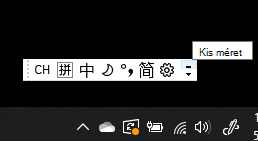
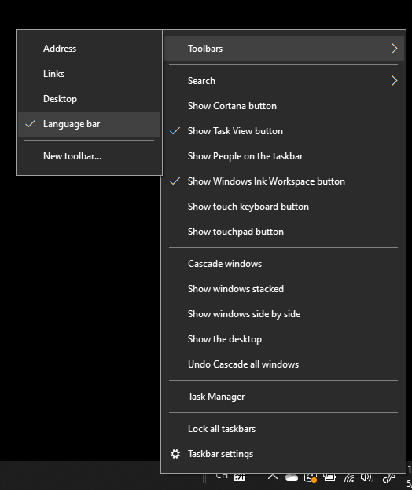
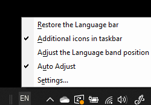

# A nyelvi eszköztár elrejtése, megjelenítése vagy alaphelyzetbe állítása

**A nyelvi eszköztár kis méretűre állításhoz:**

A nyelvi eszköztár jobb felső sarkában kattintson a kis méret gombra. Vagy egyszerűen húzza a nyelvi eszköztárat a tevékenységsávra, amely automatikusan kis méretűvé fogja azt.

**A nyelvi eszköztár előugró ablakának be- vagy kiugró ablaka:**

Ha nem szeretné a tálcán a nyelvi eszköztárat rögzítettetni, kattintson a jobb  gombbal a tálcán lévő üres területre, és törölje a jelölést az Eszköztárak menü Nyelvi eszköztár lehetőségéből. A nyelvi eszköztár így a tálcán kívül is megjelenik, ahogy az előző képernyőképen látható.

**A nyelvi eszköztár alapértelmezett visszaállítása:**

Kattintson a jobb gombbal az eszköztár nyelv gombjára, és válassza **A** nyelvi eszköztár visszaállítása parancsot. Ezzel visszaállítja az alapértelmezett beállítást.

