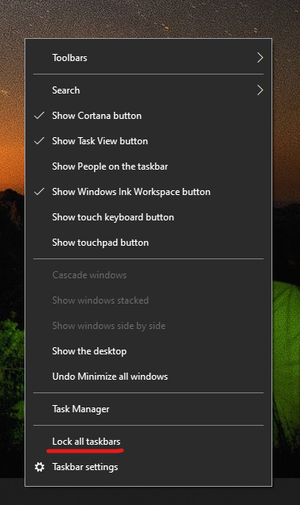

# A tálca áthelyezése az asztal egyik oldalára vagy tetejéreMove the taskbar to either side or the top of your desktop

Először győződjön meg arról, hogy a tálca nincs zárolva.First, please confirm that the taskbar is unlocked. Annak kiderítéséhez, hogy a tálca nincs-e zárolva, kattintson a jobb gombbal a tálcán egy üres területre, és nézze meg, hogy **A tálca zárolása** mellett látható-e egy pipa.To find out whether yours is unlocked, right-click any empty space on the taskbar and see whether **Lock the taskbar** has a checkmark next to it. Ha van pipa, a tálca zárolva van, és nem lehet áthelyezni.If there is a checkmark, the taskbar is locked and cannot be moved. Ha rákattint egyszer **A tálca zárolása** lehetőségre, ezzel feloldja a zárolást, és eltávolítja a pipát.Clicking **Lock the taskbar** once will unlock it and remove the checkmark.

Ha több monitorral is rendelkezik, amelyeken látható a tálca, akkor a **Minden tálca zárolása** lehetőség látszik.If you have multiple monitors that display the taskbar, you will see **Lock all taskbars**.

Miután feloldotta a tálca zárolását, lenyomva tarthat a tálcán egy üres területet, és a képernyőn a kívánt helyre húzhatja.Once the taskbar is unlocked, you can press and hold any empty space on the taskbar and drag it to the location you want on the screen. Ezt úgy is megteheti, hogy a jobb gombbal a tálcán egy üres területre kattint, és a **[Tálcabeállítások](ms-settings:taskbar?activationSource=GetHelp) > Tálca helye a képernyőn** elemre lép.You can also do so by right-clicking on any empty space on the taskbar and go to **[Taskbar settings](ms-settings:taskbar?activationSource=GetHelp) > Taskbar location on screen**.
