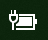

# Hiányzik a főkapcsoló- vagy akkumulátor ikon a Windows 10 rendszerbenPower or battery icon missing in Windows 10

Ha Windows 10-es eszköze rendelkezik akkumulátorral (például szünetmentes táphoz USB-n keresztül csatlakoztatott laptop, táblagép vagy asztali számítógép), általában a tálcán az óra mellett látható egy áram- vagy akkumulátor ikon, például:If your Windows 10 device has a battery (e.g., laptop or tablet, or a PC connected via USB to a UPS), normally a power/battery icon is shown in the taskbar near the clock, for example:

Ha nem látja ezt az ikont, lehet, hogy el van rejtve:If you don't see this icon, it may be hidden:

1. Ugorjon a **[Gépház > Személyre szabás > Tálca](ms-settings:taskbar?activationSource=GetHelp)** lapra.Go to **[Settings > Personalization > Taskbar](ms-settings:taskbar?activationSource=GetHelp)**.

2. Az Értesítési területen kattintson **A tálcán megjelenő ikonok kiválasztása** lehetőségre.In the Notification area, click **Select which icons appear on the taskbar**.

3. Ezután keresse meg **Főkapcsoló** elemet a listában, és a kapcsolót állítsa a **Be** értékre.Then find the **Power** item in the list and toggle its setting to **On**.

    

**Hibaelhárítás****Troubleshooting**

Ha követte a fenti utasításokat, és a **Főkapcsoló** váltója kiszürkül vagy nem látható, írja be a tálca keresőmezőjébe az **eszközkezelő** kifejezést, majd a találatok listájában válassza az **Eszközkezelő** elemet.If you followed the above instructions and the **Power** toggle is greyed out or not visible, in the search box on the taskbar, type **device manager**, and then select **Device Manager** in the list of results. Az **Akkumulátorok** csoportban kattintson jobb gombbal az eszköz akkumulátorára, kattintson a **Letiltás** elemre, majd kattintson az **Igen** lehetőségre.Under **Batteries**, right-click the battery for your device, click **Disable**, and click **Yes**. Várjon néhány másodpercet, majd kattintson jobb gombbal az akkumulátorra, és válassza az **Engedélyezés** lehetőséget.Wait a few seconds, and then right-click the battery and click **Enable**. Ezután indítsa újra az eszközt.Then restart your device.

Ha követte fenti utasításokat, de az akkumulátor ikonja nem jelenik meg a tálcán, írja be tálcán a keresőmezőbe a **feladatkezelő** kifejezést, majd a találatok listájában válassza a **Feladatkezelő** elemet.If you followed the above instructions, but the battery icon does not appear on the taskbar, in the search box on the taskbar, type **task manager**, and then click **Task Manager** in the list of results. A **Név** csoportban található **Folyamatok** lapon kattintson jobb gombbal az **Intéző** elemre, majd kattintson az **Újraindítás** parancsra.On the **Processes** tab, under **Name**, right-click **Explorer**, and then click **Restart**.
