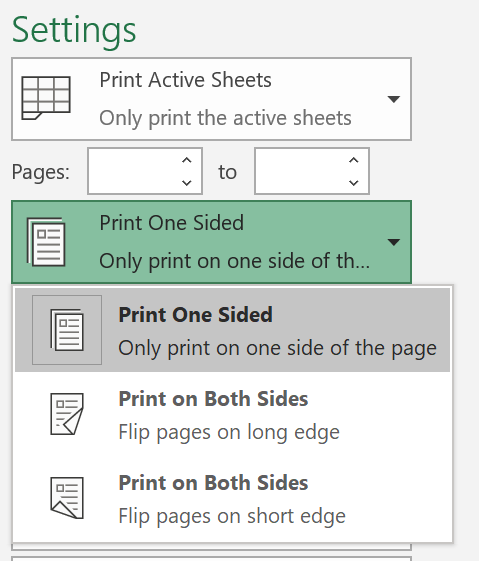
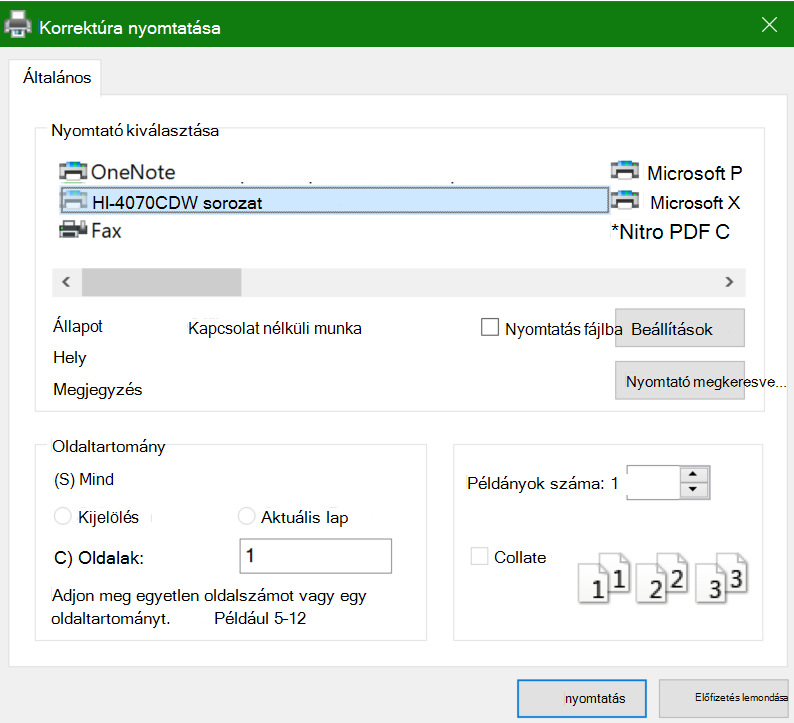

# Nyomtatás a papír mindkét oldalára (kétoldalas nyomtatás)

**Használható a nyomtatóm kétoldalas nyomtatásra?**

A nyomtató funkció-összefoglalásának vagy kézikönyvének meg kell tudnia mondani, hogy alkalmas-e a papír mindkét oldalára való nyomtatásra, más néven a "kétoldalas nyomtatásra". Ha van Microsoft Office, másik lehetőségként megnyithat egy Office-app-fájlt, például a Wordet vagy a Excel-t, a Fájl **> Nyomtatás** lehetőséget választva győződjön meg arról, hogy a megfelelő nyomtató van kijelölve, és keresi a lehetőséget a Gépház szakaszban. Például: 

**Kétoldalas nyomtatás Microsoft Office**

Ha nyomtatója mindkét oldalra képes nyomtatni, a **Fájl > Nyomtatás** a Office-app-ban lehetőség látható a "Kétoldalra nyomtatás" beállításra, a fenti példában látható módon.  Válassza ki a kívánt típusú kétoldalas nyomtatást (a hosszú él  mentén tükrözheti, vagy a rövidebb él mentén tükrözheti), majd a Nyomtatás gombra kattintva indítsa el a nyomtatást.

**Kétoldalas nyomtatás bármely alkalmazásból**

Nyomtatáskor számos appban egy általános nyomtatási párbeszédpanel jelenik meg, amely így néz ki: 

Győződjön meg arról, hogy a megfelelő nyomtató van kijelölve, majd kattintson a **Beállítások gombra** a nyomtatóbeállítások ablakának megnyitásához. Ha a nyomtató képes kétoldalas nyomtatásra, az aktuális nyomtatási feladatra vonatkozó engedélyezés lehetősége ebben az ablakban jelenik meg.
