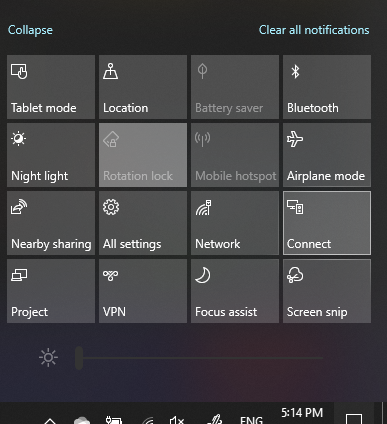

# Kivetítás PC-re

A kivetítés céleszközén a "Kivetítés beállításai" kifejezésre keresve nyissa meg a Kivetítés beállításai lapot **erre a gépre.** Ezután győződjön meg arról, hogy:
- "Egyes Windows- és Android-eszközök kivetíthet erre a gépre, amikor azt mondja, hogy az OK" legördülő menü Mindig **kikapcsolva.**
- A "Kivetítés erre a gépre" legördülő menü minden alkalommal, amikor **kapcsolat** szükséges.
- A "PIN-kód megkövetelása a párosításhoz" legördülő menüben a Never **(Soha) beállítás van megállítva.**

A céleszközön indítsa el a **Csatlakozás** alkalmazást a **Start menüben,** és keressen rá a "Csatlakozás" szóra.

Ezután a forráseszközön, amelyről projektet próbál ki vetni:

1. A **Műveletközpont megnyitásához nyomja** le a Windows billentyű + A billentyűkombinációt.
2. Kattintson a **Csatlakozás gombra.**
3. Kattintson arra az eszközre, amelyre a képernyőt kivetíti.

A fenti lépések után a céleszköznek úgy kell megjelenítenie a képernyőt, mintha az egy másodlagos monitor lenne.
