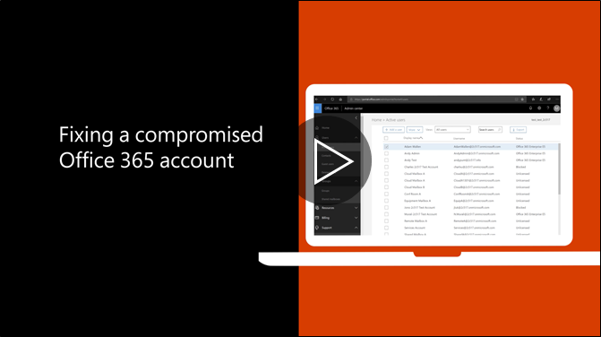

# Egy fiókjának megtámadása esetén végrehajtandó lépések

  
1. [A felhasználói jelszó alaphelyzetbe állítása](https://support.office.com/article/7a5d073b-7fae-4aa5-8f96-9ecd041aba9c) azonnal. Az új jelszó e-mail-en keresztül kommunikál a végfelhasználónak. 
    
2. Távolítsa el a bármely gyanús [címek továbbítási](https://support.office.com/article/ab5eb117-0f22-4fa7-a662-3a6bdb0add74) postafiók szinten. 
    
3. Távolítsa el a postaláda belül gyanús [Beérkezett üzenetekre vonatkozó szabályok](https://support.office.com/article/1433E3A0-7FB0-4999-B536-50E05CB67FED) . 
    
4. Ha a felhasználó a küldő e-mail, [Keresse fel a korlátozott jogú felhasználók feloldása a fiók](https://protection.office.com/?hash=/restrictedusers)le van tiltva. Ezt követően az a felhasználó tudja küldje az üzeneteket 1 órán belül kell lennie.
    
5. Távolítsa el a felhasználói fiók [felügyeleti csoportokat](https://support.office.com/article/eac4d046-1afd-4f1a-85fc-8219c79e1504) , mindaddig, amíg nem biztos abban, hogy a fiók már nem sérül. 
    
Minimalizálása érdekében a jövőben adatok megsértése vagy feltört fiókot, ajánlott az [Office 365 biztonsági gyakorlati tanácsok cikk](https://support.office.com/article/9295e396-e53d-49b9-ae9b-0b5828cdedc3)olvasása.
  

