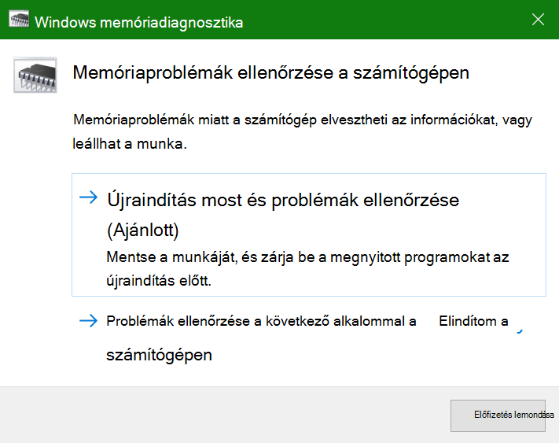
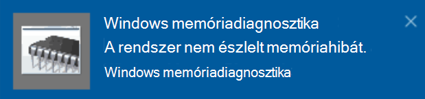

# A Windows memóriadiagnosztika futtatása a Windows 10-ben

Ha a Windows és a PC-n telepített alkalmazások összeomlanak, lefagynak vagy instabilan működnek, probléma lehet a PC memóriájával (a RAM-mal). A Windows memóriadiagnosztika futtatásával ellenőrizheti, hogy vannak-e problémák a PC RAM-jával kapcsolatban.

A tálcán lévő keresőmezőbe írja be a **memóriadiagnosztika** szót, majd válassza ki a **Windows memóriadiagnosztika** alkalmazást. 

A diagnosztika futtatásához a PC-nek újra kell indulnia. Lehetősége van azonnal újraindítani a PC-t (először mentse a munkáját, és zárja be a megnyitott dokumentumokat és e-maileket), vagy beütemezheti a diagnosztika automatikus futtatását a PC következő újraindulásakor:

A PC újraindítása után automatikusan futni kezd a **Windows memóriadiagnosztika eszköz**. A diagnosztika futása során megjelenik az állapot és a folyamat előrehaladása, és a billentyűzeten levő **ESC** billentyű lenyomásával megszakíthatja a diagnosztikát.

A diagnosztika befejeződése után a Windows a szokásos módon elindul.
Közvetlenül az újraindítás után, az asztal megjelenésekor megjelenik egy értesítés (a tálcán lévő **Műveletközpont** ikon mellett), amely jelzi, hogy találhatók-e memóriahibák. Például:

Ez itt a Műveletközpont ikonja:  

Ez pedig egy példa az értesítésre: 

Ha elmulasztotta az értesítést, a tálcán lévő **Műveletközpont** ikon kiválasztásával megjelenítheti a **Műveletközpontot**, amely tartalmazza az értesítések görgethető listáját.

A részletes információk áttekintéséhez írja be az **esemény** szót a tálcán található keresőmezőbe, majd válassza az **Eseménynapló** alkalmazást. Az **Eseménynapló** bal oldali ablaktáblájában lépjen a **Windows-naplók > Rendszer** elemre. A jobb oldali ablaktáblában fentről lefelé haladva nézze át a listát, és figyelje a **Forrás** oszlopot, amíg nem talál olyan eseményeket, amelyeknél a Forrás értéke **MemoryDiagnostics-Results**. Jelölje ki sorban mindegyik ilyen eseményt, és a lista alatti **Általános** lapon levő mezőben tekintse meg az eredményeket.
