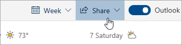

# Megosztás a Webes Outlookkal

A Naptár ban a lap tetején lévő eszköztáron válassza a **Megosztás**lehetőséget, és válassza ki a megosztani kívánt naptárat.

    

**Megjegyzés:** Nem oszthatsz meg mások tulajdonában lévő naptárakat.

- Adja meg annak a személynek a nevét vagy e-mail címét, akivel meg szeretné osztani a naptárát.
- Adja meg, hogyan szeretné használni a naptárát az illető:
    - **Megtekinthetem, ha elfoglalt**   vagyok lehetővé teszi számukra, hogy lássák, ha elfoglalt vagy, de nem tartalmaz olyan részleteket, mint például az esemény helye.
    - **Megtekintheti a címeket és a helyeket**   lehetővé teszi számukra, hogy lássák, ha ön elfoglalt, valamint az események címét és helyét.
    - **Megtekintheti az összes részletet**   lehetővé teszi számukra, hogy minden részletet az eseményeket.
    - **Szerkesztheti**   lehetővé teszi a naptár szerkesztését.
    - **Delegált**   lehetővé teszi, hogy szerkesztsék a naptárat, és megosszák másokkal.
- Válassza **a Megosztás**lehetőséget.
