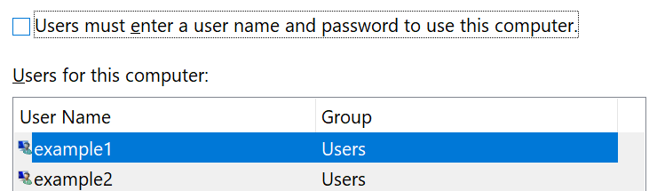

# Bejelentkezés az Windows 10 használata nélkül

Ha el szeretné kerülni, hogy jelszót kelljen megadnia az Windows rendszer indításakor, javasoljuk, hogy használja az Windows Hello biztonságos bejelentkezési beállításait, például PIN-kódot, arcfelismerést vagy ujjlenyomatot, ha van ilyen. Ha valóban le szeretné tiltani a biztonságos bejelentkezést, olvassa el alább az "Automatikus bejelentkezés a bejelentkezéshez Windows 10 utasításokat.

**A Windows Hello alternatívái biztonságának biztosítása**

Válassza **a Gépház > fiókok > Bejelentkezési** lehetőségek lehetőséget (vagy kattintson [ide).](ms-settings:signinoptions?activationSource=GetHelp) Az elérhető bejelentkezési lehetőségek listája megjelenik. Például:

A beállításhoz kattintson vagy koppintson az egyik beállításra. Amikor legközelebb elindítja vagy feloldja a Windows, jelszó helyett használhatja az új beállítást. 

**Automatikus bejelentkezés a Windows 10**

**Megjegyzés:** Az automatikus bejelentkezés kényelmes, de biztonsági kockázatot jelent, különösen akkor, ha a számítógép több felhasználó számára is elérhető. 

1. Kattintson vagy koppintson a **Start** gombra a tálcán.

2. Írja **be a netplwiz parancsot,** és nyomja le az Enter billentyűt a Felhasználói fiókok ablak megnyitásához.

3. A **Felhasználói fiókok csoportban** kattintson arra a fiókra, amelybe automatikusan be szeretne jelentkezni Windows indításakor.

4. Törölje "A felhasználóknak meg kell adnia egy felhasználónevet és jelszót a számítógép használatához" jelölőnégyzet jelölését.

    

5. Kattintson az **OK** gombra. A program kérni fogja, hogy adja meg és erősítse meg a kijelölt fiók jelszavát. A **befejezéshez kattintson** az OK gombra. Amikor legközelebb Windows 10, a rendszer automatikusan bejelentkezik a kiválasztott fiókba.
