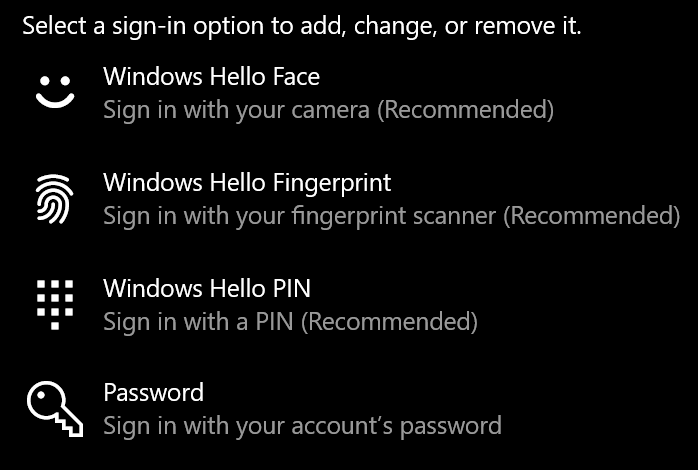
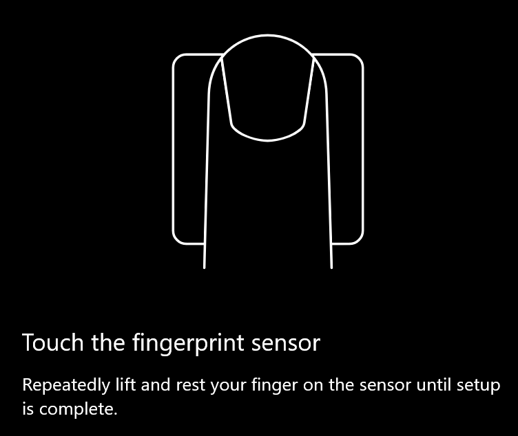
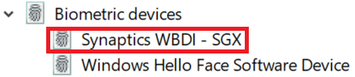

# Ujjlenyomat-zárolás feloldása a Windows 10

**Ujjlenyomat Windows Hello engedélyezése**

Ha ujjlenyomatával Windows 10 feloldani a zárolást, be kell állítania Windows Hello ujjlenyomatot úgy, hogy legalább egy ujját hozzáadja (Windows megtanulja felismerni). 

1. Válassza **a Gépház > fiókok > Bejelentkezési** lehetőségek lehetőséget (vagy kattintson [ide).](ms-settings:signinoptions?activationSource=GetHelp) Az elérhető bejelentkezési lehetőségek listája megjelenik. Például:

    

2. Kattintson vagy koppintson az **Windows Hello gombra,** majd kattintson a **Beállítás gombra.** A Windows Hello kattintson az Első **lépések elemre.** Az ujjlenyomat-érzékelő aktiválódik, és a rendszer megkéri, hogy helyezze az ujját az érzékelőre:

   

3. Kövesse az utasításokat, amely arra fogja kérni, hogy többször olvassa be az ujját. Ha ezzel végzett, további ujjakat is adhat hozzá, amelyekre a bejelentkezéshez szükség lehet. Amikor legközelebb bejelentkezik a Windows 10, az ujjlenyomatával is ezt is meg tudja tenni.

**Windows Hello Az ujjlenyomat nem érhető el bejelentkezési lehetőségként**

Ha az Windows Hello-ujjlenyomat nem jelenik meg a bejelentkezési lehetőségek között, az azt jelenti, hogy az Windows nem tud a számítógéphez csatlakoztatott **ujjlenyomat-olvasóról** vagy szkennerről, vagy hogy egy rendszer házirend akadályozza a használatát (ha például a számítógépét a munkahelye kezeli). Hibaelhárítás: 

1. Válassza a **Start gombot** a tálcán, és keresse meg az **Eszközkezelőt.**

2. Kattintással vagy koppintással nyissa meg az **Eszközkezelőt.**

3. Az Eszközkezelőben bontsa ki a biometrikus eszközöket a sávnyílra kattintva.

   

4. Az ujjlenyomat-olvasónak biometrikus eszközként, például a Synaptics WBDI scannerben kell lennie:

   

5. Ha az ujjlenyomat-olvasó nem látható, és a képolvasó integrálva van a PC-be, akkor a számítógép gyártójának webhelyére kell visszalaposodni. A pc-modell technikai támogatási szakaszában keressen Windows 10 telepíthető képolvasót.

6. Ha a képolvasó nem pc-n keresztül van csatlakoztatva (USB-n keresztül csatlakoztatva), a képolvasó gyártójának webhelyén megkeresheti és telepítheti Windows 10 képolvasó modellhez használt eszközillesztőt.
