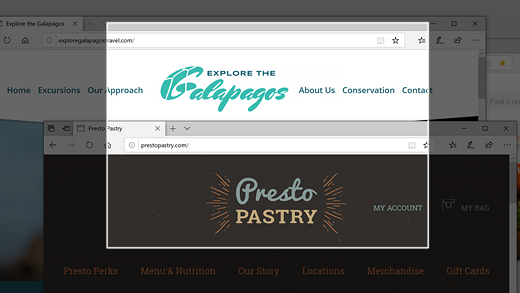
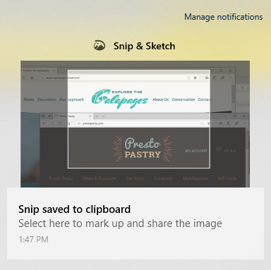

# Képek rögzítése, megjelölése és megosztása a metszet & vázlat segítségével

A képernyő vázlata most a **darab & vázlat**néven ismert. **Metszet gyors**elkészítése:

1. Nyomja le a **Windows billentyű + SHIFT + S**billentyűkombinációt. A képernyő elsötétül, és a kurzor keresztként jelenik meg. 

2. Válassza ki a másolni kívánt terület szélén lévő pontot, majd kattintson a kurzorra a bal gombbal. 

3. Vigye a kurzort a rögzíteni kívánt terület kiemeléséhez. Ekkor megjelenik a rögzített terület a képernyőn.

   

A program a vágólapra menti a képet a vágólapra, és készen áll arra, hogy beillesszen egy e-mailbe vagy dokumentumba. 

**Ha szerkeszteni vagy megtekinteni szeretné a képet**: 

- Kattintson az értesítések ikonra a tálca jobb szélén; kattintson az imént rögzített képre. A metszet a metszet & vázlat alkalmazásban nyílik meg.

   
