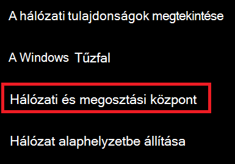
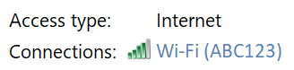
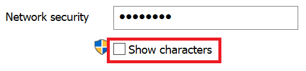

# A Wi-Fi jelszavának megtekintése a Windows 10-ben

1. Győződjön meg arról, hogy Windows 10 rendszerű számítógépe csatlakoztatva van Wi-Fi hálózathoz.

2. Válassza **a Beállítások > Hálózati & internet >** állapot lapját,  vagy kattintással vagy koppintással azonnal odamehetsz.)

3. Kattintson **a Hálózati és megosztási központ elemre.**

    

4. A **Hálózati és megosztási központban** a Kapcsolatok mellett láthatja a vezeték nélküli hálózat nevét.  Ha például a hálózat neve "ABC123", a következőt láthatja:

    

    Kattintson a vezeték nélküli hálózat nevére az Állapot Wi-Fi megnyitásához. 

5. Az Állapot Wi-Fi kattintson a Vezeték nélküli tulajdonságok **elemre,** kattintson a Biztonság **fülre,** és jelölje be a Karakterek **megjelenítése jelölőnégyzetet.**

    

